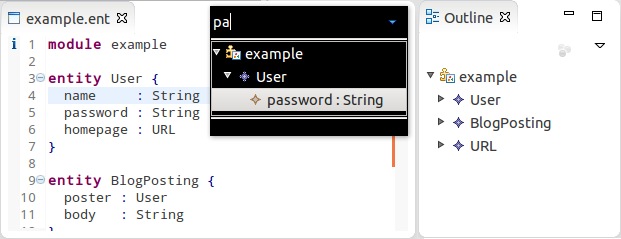
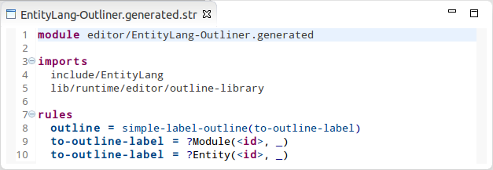
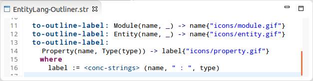

Outline View
============
Spoofax allows you to specify an outliner using Stratego and provides support for outline selection sharing, outline icons, and a quick outline view (Ctrl-O, or command-O on Mac OSX).

Basic outline
---------------------------
By default, Spoofax produces an outline based on a set of rules that map an AST node to an outline label (i.e. a String). For example, assuming the AST contains the terms ``Entity("Book", [])`` and ``Entity("Library", [])``, adding a rule ``to-outline-label = Entity(<id>, _)`` will result in two nodes with labels ``Book`` and ``Library`` to show up in the outline view.

The ``to-outline-label`` rules can be defined in ``editor/YourLang-Outliner.str``. However, based on heuristics, some of these rules already get generated from your grammar every time you build your project:

The generated rules can be found in ``editor/YourLang-Outliner.generated.str``. They can be customized by copying them to ``editor/YourLang-Outliner.str`` and by removing the ``editor/YourLang-Outliner.generated.str`` import. Here is an example of a more complex rule:

        to-outline-label = ?Property(name, Type(type)); !(name, " : ", type); conc-strings

Outline icons
-------------
Icons can be added to your outline by annotating outline labels with a path to an image file.

Custom outline
------------------------------
Once can customize the outline further by implementing an own ``outline`` strategy. The strategy takes a five-tuple (i.e. ``(node, position, ast, path, project-path)``) and is expected to produce an outline tree in the following format: ``Node("label1", [Node("label2", [...])])``. Note: a list of outline nodes is also allowed: ``[Node("label1", []), ...]``.
	
The name of the custom strategy should be defined in ``editor/YourLang-Views.esv``:

        outline view: your-custom-outline-strategy (source)
          expand to level: 3

Selection-based outline
-----------------------
The outline is normally based on the current AST and is updated whenever the AST changes. However, one can also base the outline on the current text selection, by adding the option ``(onselection)`` to the outline rule definition:

        outline view: some-outline-strategy (source) (onselection)
          expand to level: 3

With this option enabled, the first term of the five-tuple will now hold the selected portion of the AST. Furthermore, the outline strategy will now be invoked every time the user changes the text selection in the editor.

Outline based on analyzed AST
-----------------------------
Currently, there is no support yet for an outline based on the analyzed AST. Leaving away the option `(source)` from ``editor/YourLang-Views.esv`` currently has no effect.

Converting esv-based outline specifications
-------------------------------------------
Previously, outlines in Spoofax were defined in .esv files. However, support for esv-based ouline specification has been discontinued as of Spoofax version 1.2.

One can convert the ESV-based outline to a Stratego-based outline as follows:

- For each rule in ``editor/YourLang-Outliner.esv``, add a corresponding ``to-outline-label`` rule to ``editor/YourLang-Outliner.str``
- Add the import ``editor/YourLang-Outliner`` to ``trans/YourLang.str``
- Add the import ``editor/YourLang-Views`` to ``editor/YourLang.main.esv`` and remove the import ``YourLang-Outliner`` from ``editor/YourLang.main.esv``
- Delete file ``editor/YourLang-Views.esv``
- Add the following strategy to ``trans/YourLang.str``:

        editor-outline:
          (node, position, ast, path, project-path) -> outline
          where
            outline := <simple-label-outline(to-outline-label)> ast
