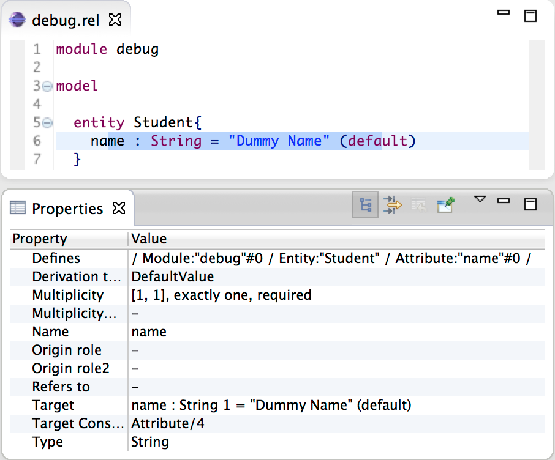

# Properties View

A property view has been added that shows properties for the selected AST node.

- By default, the new properties view integrates with NaBL and presents (NaBL) properties associated with the selected text in the editor.
- The properties view can be customized to show different kinds of properties, either to aid language development or to provide language users with additional information about their programs.

## 1. How to migrate old projects

enable the view in `editor/[Language]-Views.esv`

	properties view: editor-properties

make sure the `[Language]-Views.esv` is imported in `editor/[Language].main.esv`

    imports
        // ...
        Relations-Views

Specify the builder `editor-properties`

	// Gathers the properties for the properties view.
	editor-properties:
		(target, position, ast, path, project-path) ->
			<get-all-editor-properties(pp-partial-[Languge]-string |<language>, project-path)>target

Optional: get the same information in hover:

	editor-hover:
		(target, position, ast, path, project-path) ->
			<get-editor-properties(pp-partial-[Language]-string |<language>, project-path);properties-to-html>target

Lastly `pp-partial-[Language]-string` should be correctly defined.

    pp-partial-[Language]-string =
      prettyprint-example
      ; !V([], <id>)
      ; box2text-string(|120)

## 2. Customize the property view

### Different properties

Add custom properties to the view. Note that all keys and values should all be `String`, but you can use `pp-property` (see below).

	editor-properties:
		(target, position, ast, path, project-path) -> <conc> (defaultProps, myProps)
			with 
				defaultProps := <get-all-editor-properties(pp-Entity-string |<language>, project-path)>target;
				myProps := [("Dummy Key", "Dummy Value"),("Nested Dummy", [("1", "a"),("2", "b")])]

One can filter the default properties also by modifying the `defaultProps` in the example above.

### Pretty printer for values

The integrated pretty printer can pretty print the following

- (partial) ASTs of your language
- URIs
- Strings (ignores them)
- Anything: as a last resort it uses `write-to-string` to convert any term to `String`. 

You can specify rules for custom pretty printing:

	pp-property : ZeroOrOne()  -> "[0, 1], zero or one, maybe/nullable"
	pp-property : One() 	   -> "[1, 1], exactly one, required"
	pp-property : ZeroOrMore() -> "[0, n), zero or more, maybe/nullable"
	pp-property : OneOrMore()  -> "[1, n), one or more, required"
