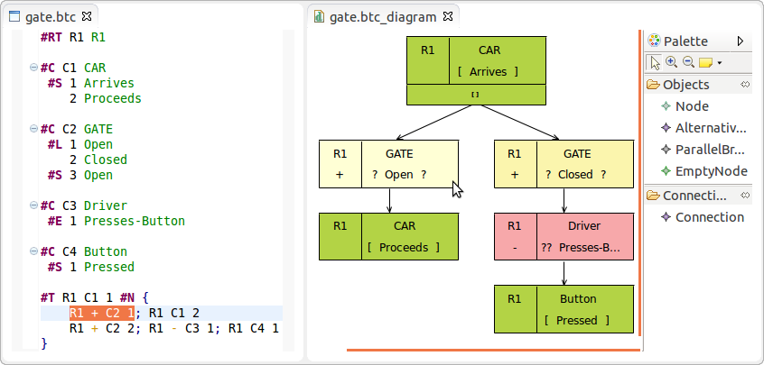
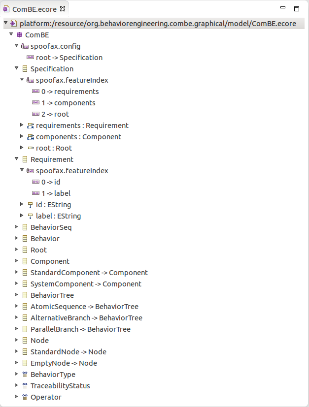

# Spoofax Modelware
Spoofax Modelware provides integration with the [Eclipse Modeling Framework (EMF)](http://www.eclipse.org/modeling/emf/) and the [Graphical Modeling Framework (GMF)](http://eclipse.org/gmf-tooling/) to allow for real-time synchronized textual and graphical editors and/or views. It also allows you to use other EMF-based tooling in combination with Spoofax.

## Features
- Real-time synchronization between Spoofax-based textual editors and GMF-based graphical editors.
- Error recovery during synchronization to allow for synchronization in the occurrence of parse errors, unresolved names and incomplete models.
- Textual and graphical layout preservation during synchronization.
- Selection sharing between editors.
- Possibility to persist EMF models using a user-defined textual syntax.

## Limitations
- It is not possible to generate an example project in Spoofax.
- There is no working conversion from an SDF + NABL definition to Ecore.

## Usage

### Installation
Use the Spoofax update site and select both Spoofax Core and Spoofax Modelware. This will automatically install GMF.

### Recommended approach for creating synchronized editors
- Independently develop a textual and graphical editor/view for your language, then glue them together using Stratego.
- Create an Ecore that resembles the structures in the graphical syntax as much as possible (e.g. model a linked list in the graphical syntax as a linked list in the metamodel). GMFMap only supports a limited set of mappings between structures in the Ecore and the graphical model, so by having similar structures, you will avoid the need for customization of GMF-generated Java code.

Tip: If you are unfamiliar with GMF, you may want to try [EuGENia](http://www.eclipse.org/epsilon/doc/eugenia/) first. EuGENia is a tool that automatically generates the .gmfgraph, .gmftool and .gmfmap models needed to implement a GMF editor from a single annotated Ecore metamodel.

### Required Ecore annotations 

TODO

### Required Stratego code

TODO

    imports
      runtime/modelware/-
      runtime/index/-
      runtime/task/-
      editor-common.generated
  
    rules

      tree2model =
        index-setup(|<language>, <project-path>); task-setup(|<project-path>);
        ?(<id>, _); ASTtext-to-ASTgraph; mw-tree2model

      model2tree = ?(<id>, _); ASTgraph-to-ASTtext

### EMF Resource Factory extension point

If you would like to persist your EMF models using your textual syntax rather than the default XMI format, and avoid persisting the same information twice, then add the following extension point to an arbitrary Eclipse plugin:

    <extension point="org.eclipse.emf.ecore.extension_parser">
       <?gmfgen generated="false"?>
       <parser
             type="btc"
             class="org.spoofax.modelware.gmf.resource.SpoofaxGMFResourceFactory"/>
    </extension>

- This requires you to add a dependency to `org.spoofax.modelware.gmf`.
- The type should correspond to the file extension of your Spoofax language (here: `.btc`).

### Synchronizer extension point

Add the folowing extension point to an arbitrary Eclipse plugin:

     <extension point="org.spoofax.modelware.gmf.synchronizer">
        <?gmfgen generated="false"?>
        <synchronizer
              diagramFileExtension="btc_diagram"
              domainFileExtension="btc"
              nsURI="org.behaviorengineering.combe"
              textFileExtension="btc">
        </synchronizer>
     </extension>

- This requires you to add a dependency to `org.spoofax.modelware.gmf`.
- The `diagramFileExtension` and the `domainFileExtension` should correspond to the `Diagram File Extension` and the `Domain File Extension` set in your .gmfgen model.
- The `nsURI` should correspond to the `NS URI` set in your .ecore model.
- The `textFileExtension` should correspond to the file extension of your Spoofax language.
- At runtime, editors will synchronize if they have the same file name. Here, for example, `test.btc` will synchronize with `test.btc_diagram` but not with `test2.btc_diagram`.

## Resources

- Spoofax Modelware issue tracking: http://yellowgrass.org/project/Spoofax+Modelware
- Related paper: http://swerl.tudelft.nl/twiki/pub/Main/TechnicalReports/TUD-SERG-2013-009.pdf
- EMF home: http://www.eclipse.org/modeling/emf/
- GMF-Tooling home: http://eclipse.org/gmf-tooling/
- EuGENia home: http://www.eclipse.org/epsilon/doc/eugenia/
- ComBE home (example use case): http://oskarvanrest.github.com/ComBE/

